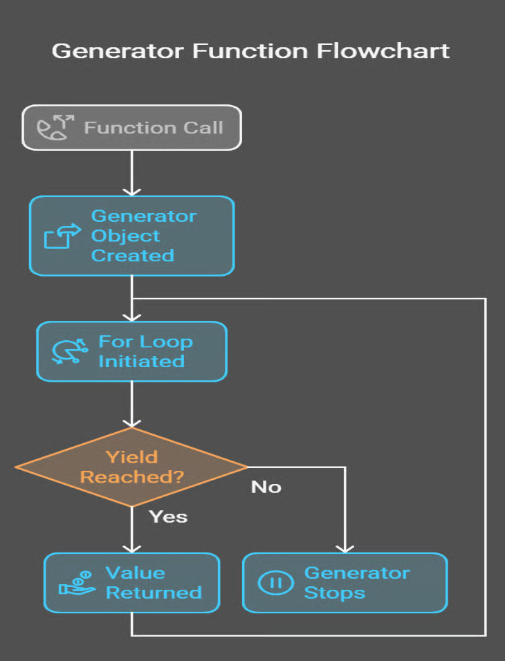

# Generators in Python

Generators are used to optimize memory usage and to simplify workflows. 
They are particularly useful when dealing with an infinite sequence, impossible to store all at once. 

It's important to be aware that a generator cannot be reused: once it finishes, it needs to be recreated if another complete iteration is needed.

Another important aspect is the *asynchronous* part of using generators, since otuputs are produced on-demand. 
In this case may be necessary to combine them with `asyncio` library. 

- [Generators in Python](#generators-in-python)
  - [What are generators?](#what-are-generators)
  - [Basic implementation](#basic-implementation)
  - [Why Generators?](#why-generators)
  - [Advanced concepts and commands](#advanced-concepts-and-commands)
    - [.send()](#send)
    - [.throw()](#throw)
    - [.close()](#close)

## What are generators? 
Python generators are a special kind of function that produces a sequence of values slowly, processing each unit before moving to the next one. This is performed through the `yield` keyword, which produces, unlike `return` that outputs a single value and exits the function, a value then pauses, saves its state and it continues from where it left when it's called again. 

## Basic implementation

```python
def integers_gen(n):
    for i in range(0, n): 
        yield i #pauses here, return i and then stops; 

for num in integers_gen(5):
    print(num)
```

This returns: 

```python
0
1
2
3
4
```
Note that Generators produce an object that can be iterated over.

Here's a graph of the workflows: 
<p align="center">
  
</p>

## Why Generators? 
Unlike others iterable, such as lists or arrays, that stores all their elements in memory simultaneously, generators produce values on the fly, so they hold one item in memory at a time.
A direct consequence is the possibility of holding infinite sequences: 

```python

def fibonacci():
    a,b = 0,1
    while True:
        yield a
        a,b = b, a+b

fib = fibonacci()
for _ in range(10):
    print(next(fib)) #next() command is explained later; 
```

this will return the first 10 Fibonacci numbers indefinetely without running out of memory. 

## Advanced concepts and commands

### .send()
The `.send()` method allows to pass values to a generator: 

```python
def accumulator():
    total = 0
    while True:
        value = yield total
        if value is not None:
            total += value

# Using the generator
acc = accumulator()
next(acc)  # Start the generator
print(acc.send(10))  # Output: 10
print(acc.send(5))   # Output: 15
print(acc.send(20))  # Output: 35
```
in such a way 
1. the generators start with `next(acc)`,
2. `.send(value)` passes a value into the generator, assigning it to `value` in the `yield` statement,
3. the generator works with the sent value, updating its state. 

### .throw()
As can be deduced, this method is used to throw an error inside the generator: 

```python 
def resilient_generator():
    try:
        for i in range(5):
            yield i
    except ValueError:
        yield "Error occurred!"

# Using the generator
gen = resilient_generator()
print(gen.throw(ValueError)) #This triggers exception; 
```

### .close()

The `.close()` method stops a generator by raising an exception.

```python 

def infinite_counter():
    count = 0
    try:
        while True:
            yield count
            count += 1
    except GeneratorExit:
        print("Generator closed!")

# Using the generator
counter = infinite_counter()
counter.close()       # Output: "Generator closed!"
```