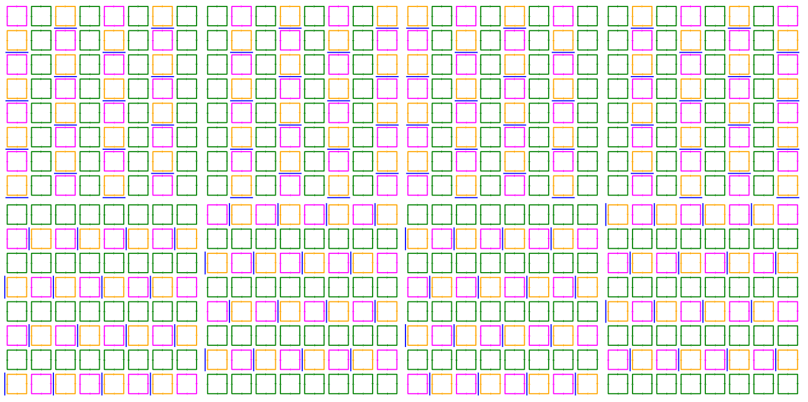

Here's a list of observations and facts useful for my personal understanding of Normalizing Flows for Lattice Gauge Theories (LGT). 

- [1. How is the training done?](#1-how-is-the-training-done)
  - [1.1. In what sense the NIS is different from sampling with $p$?](#11-in-what-sense-the-nis-is-different-from-sampling-with-p)
- [2. How does the masking work?](#2-how-does-the-masking-work)
  - [2.1. A simple model](#21-a-simple-model)
  - [2.2. Coupling layers in LGT](#22-coupling-layers-in-lgt)
  - [2.3. The importance of masking and of equivariant layers](#23-the-importance-of-masking-and-of-equivariant-layers)
    - [2.3.1. Equivariant layers](#231-equivariant-layers)
    - [2.3.2. The coupling functions](#232-the-coupling-functions)
  - [2.4. How exactly the CNN acts on a give configuration?](#24-how-exactly-the-cnn-acts-on-a-give-configuration)
    - [2.4.1. How the hidden channels do work?](#241-how-the-hidden-channels-do-work)

# 1. How is the training done?
The optimal parameters are found by minimizing the $D_{KL}$ (forward or reverse) loss: $$
\begin{equation}
\begin{align*}
        \text{reverse:} \ \ \ D_{KL}(q|p) &= \int_{\Omega} q(\phi|\theta) \big( \log q(\phi|\theta) - \log p(\phi) \big) \ \mathcal{D}\phi \\
        \text{forward:} \ \ \ D_{KL}(p|q) &= \int_{\Omega} p(\phi|\theta) \big( \log p(\phi) - \log q(\phi|\theta) \big) \ \mathcal{D}\phi
\end{align*}
\end{equation}$$ where $q(\phi | \theta)$ is the resulting distribtuion depending on the field $\phi$ and the parameters $\theta$ and $p(\phi) \propto e^{-S}$ is the target. 
One important tecnique, known as Neural Importance Sampling, consists in reweighting the distribution: $$ \begin{equation}
\begin{align*}
\langle O \rangle_p  = \int_{\Omega} O(\phi) p(\phi) \ d\phi = \frac{\int_{\Omega} O(\phi) w(\phi) q(\phi|\theta) \ d\phi}{\int_{\Omega} w(\phi) q(\phi|\theta) \ d\phi}
\end{align*}    
\end{equation}$$ where the weights are defined as $w(\phi) = p(\phi)/q(\phi)$. In such a way the computation of $\langle O \rangle _p$ can be done knowing the weights and the flow distribution $q$.

## 1.1. In what sense the NIS is different from sampling with $p$? 
Using the reversed loss: $$ \begin{equation}
\begin{align*}
D_{KL}(q|p) = \mathbb{E}_q[\log q(\phi)] - \mathbb{E}_q [\log p(\phi)]         
\end{align*}
\end{equation}$$ all the mean values are computed respect to the distribution $q$ from which the samples $\phi$ are extracted and on which the integration (sum, in the discrete form) is performed. Therefore the target distribution is used only to evaluate its logarithm on the extracted sample.  

# 2. How does the masking work? 
In the case of LGT the masking is involved every time a coupling layer is reached, in particular each layer will have its mask which will divide the lattice into active, passive and frozen parts. 

## 2.1. A simple model
The affine coupling layer is the simplest model used for Normalizing Flows: in each such layers there's a map $f: z \in \mathbb{R}^n \longrightarrow \phi \in \mathbb{R}^n$, where the input variables $\textbf{z} = (z_1, z_2, \dots, z_n)^T$ are splitted in two equal-sized subsets $N_a$, $N_b$ (active and passive parts resp.) and then trasformed by $f$ according to: $$ \begin{equation}
\mathbf{z} \xrightarrow{f} \mathbf{\phi} = 
\begin{cases}
    \phi_a = z_a \\
    \phi_b = z_b s_b(z_a) + t_b(z_a)
\end{cases}, \ \ a \in N_a \ \wedge \ b \in N_b
\end{equation}$$ where the parameters $s_b$, $t_b$ are found by the neural network. Leaving the first $N_a$ variables unchanged produces a triangular Jacobian, therefore with tractable determinant. 
To perform a more general mapping, more coupling layers can be stacked, alternating frozen and active parts. 
Additionally, splitting the variables allows the inversion of the transformation: $$ \begin{equation}
\mathbf{\phi} \xrightarrow{f^{-1}} \mathbf{z} = 
\begin{cases}
    z_a = \phi_a \\
    z_b = [\phi_b - t_b(z_a)]/s_b(z_a)
\end{cases},  \ \ a \in N_a \ \wedge \ b \in N_b
\end{equation}$$ where, again, $\ N_a \cap N_b = \emptyset $.

## 2.2. Coupling layers in LGT
In the case of LGT, the lattice needs to be decomposed into active, passive and frozen components; as a consequence, given a bijective coupling function $\mathbf{h}$, the coupling layer transforms an initial configuration $\mathbf{\phi}$ as follows: $$ \begin{equation}
  \begin{cases}
    \phi'_{act} = \mathbf{h}(\phi_{act} | \mathbf{\Theta}(\phi_{frz})) \\
    \phi'_{frz} = \phi_{frz} \\
    \phi'_{pass} = \phi_{pass}
  \end{cases}
\end{equation}$$ where $\mathbf{\Theta}$, the conditioner, is used to calculate the parameters of the transformation, using the frozen configuration. The parameters in our case are returned by a Neural Network (CNN). 
The Jacobian matrix of such a transformation is trivially diagonal.
Tipically he coupling function acts pointwise: $$
\mathbf{h}(\phi_1, \phi_2, \dots | \mathbf{\Theta}) = (h_1(\phi_1 | \Theta_1), \ h_2 (\phi_2 | \Theta_2), \ \dots)^T$$ 
and very often all the $h_i$ are identical, the only difference is in the parameters $\Theta_i$ of the transformation. 

## 2.3. The importance of masking and of equivariant layers
As already said before, the masks are needed for the subdivsion into active, passive and frozen components. From a technical point of view, masks are generators, yielding a tuple containing at least one dictionary with `active`, `passive` and `frozen` keys. The corrisponding value (i.e. the mask) is a tensor consisting of only zeros and ones; therefore masking is done by multipling the configuration with the mask. Usually the masking pattern repeats itself after a certain number of steps (namely, after some coupling layers). 

### 2.3.1. Equivariant layers

To understand how to implement the masking in LGT, Gauge Equivariant Layers need to be introduced. The idea it's quite simple but effective: instead of learning the symmetries of the theory by training, it's more convenient to implement them in the layers themselves. This ensures that the input is consistently reflected in the output space by the Neural Network, being invariant under the same group $\mathcal{G}$ as the input. 
In other words, being $f$ the map implemented by the NN, $r_i$ and $r_f$ two representation of the simmetry group $\mathcal{G}$, it must hold: 
$$ \begin{equation}
  \begin{align*}
    f(g^{(r_i)} x) = g^{(r_f)} f(x) \ \ \ \forall g \in \mathcal{G}.
  \end{align*}
\end{equation}
$$ In the case of Lattice Gauge Theories the links $U_{\mu}$ transform as $U_{\mu}(x) \xrightarrow{\mathcal{G}} U'_{\mu}(x) = g(x + \hat{\mu}) \cdot U_{\mu} \cdot g^{-1}(x)$, therefore any traced loop is invariant under any transformation $g \in \mathcal{G}$.  
Let's start considering the untraced loop $$ \begin{equation}
  \begin{align*}
      L(\mathbf{x}) = U_{\mu}(\mathbf{x}) S(\mathbf{x} + \hat{\mu}, \mathbf{x}) 
  \end{align*}
\end{equation}$$ where $S(\mathbf{x}, \mathbf{y})$ is a generic path that starts at $\mathbf{x}$ and ends in $\mathbf{y}$. In general this quantity is not gauge-invariant, except for the case of abelian gauge groups, therefore it transforms as $$ \begin{equation}
  \begin{align*}
    L(\mathbf{x}) \longrightarrow g(\mathbf{x})L(\mathbf{x})g^{\dag}(\mathbf{x})
  \end{align*}
\end{equation}$$ so it's needed a coupling function $h$ that satisfies the following equation $$\begin{equation}
  \begin{align*}
    h(g(\mathbf{x})L(\mathbf{x})g^{\dag}(\mathbf{x})) = g(\mathbf{x})h(L(\mathbf{x}))g^{\dag}(\mathbf{x})
  \end{align*}
\end{equation}$$ namely $h$ has to be transparent to the action of the group on its argument. 
Suppose, now, to map the gauge link $U_{\mu}$ in a new updated field $U'_{\mu}$, the new closed loop will be $L' = U'_{\mu} S$ (as specified, we are changing only the link from $x$ to $x + \hat{\mu}$), therefore (the dependence from $x$ is omitted): $$\begin{equation}
  \begin{align*}
  L' = U'_{\mu} S  = h(U_{\mu}S) & \Longrightarrow U'_{\mu} = h(U_{\mu}S) S^{\dag} = h(L)S^{\dag}
  \Longrightarrow U'_{\mu} = h(L)L^{\dag}U_{\mu}.
  \end{align*}
\end{equation} $$ In such a way the transformation of links variables can be performed acting on any path $L$ with the same starting and ending points of the links. This is implemented by a coupling layer, which will used part of the loops to calculate the parameters of the transformation; in particular the conditioner $\Theta$ will depend on the frozen links and some invariant combinations of them (tipically plaquettes). 

In this case the lattice's subdivision is more involved than simple masks descrivbed preivously: there'll be a set of active links that are to be transformed by the layer; correpsonding to that, we will have a set of loops used to change them, according to (11). These will be the active loops; those loops cannot contain any other acitve links. Then there will be a set of loops containing an active link but not used to trasform it: these will be the passive links. Lastly there'll be the loops with no active links, the frozen ones, used in the conditioner and in $h$ to perform the mapping.
Here's an example of links and loops masking: 
 

  
   
  <em>U(1) masks, orange: active plaquettes, green: frozen plaquettes, purple: passive plaquettes. In blue are marked the active links. </em>

### 2.3.2. The coupling functions
We have seen that the transformations of gauge links are done by transforming $L$ with a coupling function; the guage links are elements of the group $\mathcal{G}$, impling $L \in \mathcal{G}$. In the case of $U(1)$, the gauge links can be parametrized by an angle, therefore the coupling functions have to be a diffeomorphism of the circle on itself. In a such a way, the topology is preserved (diffeomorphism implies omeomorphism) and both the functions and their inverse are differentiable, property crucial for the gradient descent.
Some examples of diffeomorphisms are:
- NCP: non-compact projection
- Mobius transformation
- Rational splines
  
## 2.4. How exactly the CNN acts on a give configuration?
We have seen previously that the Neural Networks are supposed to be used to find the optimal parameters in the conditioner in order to update the links and reproduce the target density. However it's still not completely clear how the Convolutional Neural Networks should be involved in this task.

The underlying principle is that only the frozen plaquettes (or, more generally, Wilson loops) are required to optimize the parameters via the conditioner. Therefore, the CNN input can be structured as a tensor of $n$-tuples $(\cos \alpha, \sin \alpha)$, where $\alpha$ denotes the angle of the frozen plaquette. Consequently, the architecture will employ two input channels, ensuring that the kernel weights operate directly on the trigonometric components ($\cos \alpha$ and $\sin \alpha$) lying on each pixel (plaquette or loop). 

Once found the parameters, the coupling function will be applied and the gauge links transformed according to (11). 

### 2.4.1. How the hidden channels do work? 
Since CNNs share weights across all sites to ensure translational invariance, the use of multiple kernels is particularly effective for specializing each filter in recognizing specific patterns. This is achieved through hidden channels, which define the number of kernels (and thus the number of feature maps) in each layer.

**Note**: the CNN architecture is structured as follows:
- input layer: where the raw data is fed into the network;
- convolutional layers: generated by the application of the kernels; the output will have as many feature maps (channels) as there are kernels in the layer. Of course more convolutional layers can be stacked;
- output layer: which produces the final result
