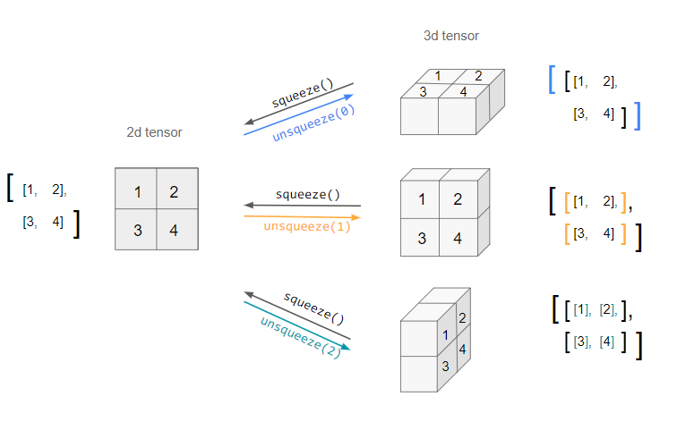

# Pytorch Tutorial

Pytorch is an open-source deep learning framework designed to simplify the process of building networks and training them. 

- [Pytorch Tutorial](#pytorch-tutorial)
- [Tensors](#tensors)
  - [Definition](#definition)
  - [Tensor operations](#tensor-operations)
  - [Some useful functions](#some-useful-functions)
    - [torch.shape()](#torchshape)
    - [torch.unsqueeze() and torch.squeeze()](#torchunsqueeze-and-torchsqueeze)
    - [torch.flatten()](#torchflatten)
    - [torch.arange()](#torcharange)
    - [torch.reshape()](#torchreshape)
    - [tensor.roll()](#tensorroll)
    - [torch.stack()](#torchstack)
- [GPU Acceleration with Pytorch](#gpu-acceleration-with-pytorch)
- [Building and training a NN with Pytorch](#building-and-training-a-nn-with-pytorch)
  - [Step 1: Define the Neural Network Class](#step-1-define-the-neural-network-class)
  - [Prepare the data](#prepare-the-data)
  - [Instantiate the model, loss function and optimizer](#instantiate-the-model-loss-function-and-optimizer)
  - [Train the model](#train-the-model)
  - [Testing the model](#testing-the-model)
- [Moving data or model to device](#moving-data-or-model-to-device)
- [Load from checkpoint: rebuilding the model](#load-from-checkpoint-rebuilding-the-model)

# Tensors

## Definition
```python
import torch 
tensor_1d = torch.tensor([1,2,3]) #this creates a vector; 
tensor2_d = torch.tensor([[1,2], [3,4]]) #this creates a matrix; 

random_tensor = torch.rand(2,3) #random tensor (matrix) 2x3; 
zeros_tensor = torch.zeros(2,3) #2x3 matrix, full of 0s; 
ones_tensor = torch.ones(2,3) #2x3 matrix, full of 1s;
```
## Tensor operations
Pytorch tensors can be
- indexed: specific elements can be accessed; 
- sliced: a portion of the tensor can be taken out;  
- reshaped: the shape (dimensions) of a tensor can be changed. The tensor is then reorganized into a different size, keeping all the original values. 

```python
import torch

tensor = torch.tensor([[1,2], [3,4], [5,6]])
element = tensor[1,0] #this takes the first element of the second row of tensor (3);
slice_tensor = tensor[:2, :] #this produces the tensor: ([[1,2], [3,4]])
reshaped_tensor = tensor.view(2,3) #this is particularly useful: form a 3x2 (tensor), we get a 2x3 without loosing any information!; 
```
## Some useful functions 
- Broadcasting: allows for automatic expasion of dimensions to facilitate arithmetic operations on tensors (can be done if the shapes are eqaul or if one of the dimensions is 1xN); 
- Matrix multiplication: efficient computations; 

```python
import torch

tensor_a = torch.tensor([[1,2,3], [4,5,6]])
torch_b = torch.tensor([[10,20,30]])

broadcasted_res = tensor_a + tensor_b #result ([[11, 22, 33], [14, 25, 36]]): 
matrix_mult_res = torch.matmul(tensor_a, tensor_a.T) #.T is the transpose operation, the total is: ([[14,32], [32, 77]]); 
```

### torch.shape() 
`torch.shape(dim)` is an alias for `torch.size(dim)`, they returns the size of a tensor. If `dim` is specified, then an int corresponding to that dimension is returned. 

```python
import torch

a = torch.empty(3,4,5) #creates an empty tensor of dimension 3x4x5; 
a.size() #tensor([3,4,5])
a.size(dim = 1) #returns 4; 
```

### torch.unsqueeze() and torch.squeeze()
The `unsqueeze(dim)` function adds another dimension in the position specified: starting, for example, from a $N \times M$ tensor, with `unsqueeze(0)` we get a $1 \times N \times M$ tensor.
Here's a detailed illustration about the action of `unsqeeze()`: 


### torch.flatten()
`torch.flatten(input, start_dim = 0, end_dim = -1)` flattens a give tensor into another one with lesser dimensions. `start_dim` is the dim. from which begin to flatten, whereas `end_dim` is the dim. where to stop.

```python
import torch

x = torch.randn(2,3,4) #tensor of size 2x3x4; 
x_1 = torch.flatten(x) #turns x into a tensor 24x1 (24 = 2x3x4); 
x_2 = torch.flatten(x, start_dim = 1) #begins to flatten from the second dimension: produceses a 2x12 ( 12 = 3x4)

y = torch.randn(2,3,4,5)
y_1 = torch.flatten(y, start_dim = 1, end_dim = 2) #reduces y to a vector 2x(12)x5; 
```
`torch.flatten` is equivalent to `.view()`, however the first one is more understandable to humans. 

### torch.arange()

`torch.arange(start, stop, step)` returns a 1D tensor of size $\frac{end - start}{step}$, rounded to the next natural number. 
`start` is optional, the defual value is 0, similarly for `step`
which default value is 1. 

Example: 
```python
import torch

a = torch.arange(4.)
print(a) #returns tensor([0, 1, 2, 3]) (thought as column-vec); 
```

### torch.reshape()
`torch.reshape(input, shape)` transforms a tensor into a second one, preserving all the elements (in case of lesser or greater number of var. in the output, an error will occur). (`shape` can be a tuple of ints). 

```python
import torch 

a = torch.arange(4)
reshaped_a = torch.reshape(a, (2,2)) #this turns ([0,1,2,3]) (a Nx1 vector) into ([[0,1],[2,3]]) (a 2x2 matrix); 
back_to_a = torch.reshape(reshaped_a, (-1,))
```
The usage of -1 as an element of the tuple, communicates pytorch to calculate that dimension in order to keep the number of degree of freedom equal. In the code above, since the second dimension isn't specified, the 2x2 matrix will be reduce to a Nx1 tensor: a vector. 

### tensor.roll()
`tensor.roll(input, shifts, dims)` is a command used to interchange cols or rows of a tensor, or to simply shift its elements. 
When `dims` is unspecified, the tensor will be flatten, its components will be shifted (periodically) by `shifts` and then its shape restored. `dims` specify the axes along which permform a switch. Here is an example

```python
import torch

x = torch.tensor([1,2,3,4,5,6]).view(3,2) #[[1,2], [3,4], [5,6]]

print(torch.roll(x, 1)) #[[6, 1], [2, 3], [4, 5]]
print(torch.roll(x, 1, 1)) #shifs the two cols; 
print(torch.roll(x, 1, 1)) #shifs the two cols twice, so returns x; 
print(torch.roll(x, 1, 0)) #[5,6] on top; 
print(torch.roll(x, 2, 0)) #[5,6] moved on top, then [3,4]; 

print(torch.roll(x, -1, 0)) #with negative values the row used is the first; 

```

### torch.stack() 
This method is used to concatenates a sequence of tensors along a new dimensions (tensors must have the same dimensions and shape). 

```python
import torch

x = torch.tensor([1.,3.,6.,10.])
y = torch.tensor([2.,7.,9.,13.])

print("join tensors dimension 0:")
t = torch.stack((x,y), dim = 0) #returns: ([[1, 3, 6, 10], [2, 7, 9, 13]])
print(t)

print("join tensors dimension 1:") #returns: ([1, 2], [3, 7], [6, 9], [10, 13]])
t = torch.stack((x,y), dim = 1)
print(t)
```
notice that when `dim = 0`, tensors are stacked increasing the number of rows, whereas when `dim = 1` tensors are transposed and the number of columns is increased.  

# GPU Acceleration with Pytorch
GPU acceleration enables much faster computations, especially important in deep learning; this can be achived by transferring tensor to the GPU.

```python
import torch

device = torch.device('cuda' if torch.cuda.is_available() esle 'cpu')
tensor_size = (10000, 10000)

a = torch.randn(tensor_size, device = device) #this defines a matrix "a", 10000x10000, full of random gaussian numbers, on the available device;  
b = torch.randn(tensor_size, device = device)

c = a + b  
```

# Building and training a NN with Pytorch

**Note**: `torch.nn` contains pre-defined layers, activation functions, loss functions and more utilities. It manages parameters, weights and biases. 
On the other side `torch.nn.functionals` includes a functional approach to work on the input data, which means that these functions woek directly on the input data, performing direct operations like convolution, pooling etc. 

**Note**: the `super` method is used to access attributes or call the `__init__()` constructor of the superclass; here's an example: 
```python
class Parent:
    def __init__(self, txt):
        self.message = txt

    def printmessage(self):
        print(self.message)

class Child(Parent):
    """Subclass of Parent"""
    def __init__(self, txt):
        super().__init__(txt) #this calls the __init__() method, initializing txt; 
    
x = Child("Hello World")
print(x.printmessage) #prints Hello World; 
```
in such a way it's not necessary to create an instance of the `Parent` class. Of course with `super()` we can call and extend any method of the superclass. 
In summa, as already said, `super()` is used to access any attribute or any method in the superclass.


## Step 1: Define the Neural Network Class

```python
import torch
import torch.nn as nn

class SimpleNN(nn.Module): #Module is the base class for all neural networks modules. Any model should be an instance of this class, as it is here; 
    def __init__(self):
        super(SimpleNN, self).__init__() #here takes two arguments, however from Python 3 and above, no parameters have to be passed; 

        self.fc1 = nn.Linear(2,4) #Linear fully-connected layer: in this case there are 2 units, while the second has 4;
        self.fc2 = nn.Linear(4,1) #1 output unit;
        #Network created: 2 x 4 x 1; 
    
    def forward(self, x): 
        x = torch.relu(self.fc1(x)) #takes the input x which passes through the first layer and then a ReLU is applied; 
        x = self.fc2(x) #x is now the output of the NN; 
        return x
```

## Prepare the data

```python
x_train = torch.tensor([[0.0, 0.0], [0.0, 1.0], [1.0, 0.0], [1.0, 1.0]]) 
y_train = torch.tensor([[0.0], [1.0], [1.0], [0.0]])
```

## Instantiate the model, loss function and optimizer

```python
import torch.optim as optim

model = SimpleNN() 
criterion = nn.MSELoss()
optimizer = optim.SGD(model.parameters(), lr=0.1)
```
## Train the model

```python
for epoch in range(100):

    model.train() #training started; 

    outputs = model(x_train)
    loss = criterion(outputs, y_train)

    optimizer.zero_grad()
    loss.backward()
    optimizer.step()

    if (epoch + 1) % 10 == 0:
        print(f'Epoch [{epoch + 1}/100], Loss: {loss.item():.4f}')
```

## Testing the model 
Last but not least (definetly...), we need to perform a test. 

```python
model.eval()

with torch.no_grad():
    test_data = torch.tensor([[0.0, 0.0], [0.0, 1.0], [1.0, 0.0], [1.0, 1.0]])
    predictions = model(test_data)
    print(f'Predictions:\n{predictions}')
```

# Moving data or model to device

The command `.to(device)` transfers model or specified data to another device (which needs to be specified before): 

```python
import torch 

device = torch.device('cpu')
x = torch.randn(1,2)
x.to(device)
```
tensor operations are permitted if on the same device. The same device has to be used for input, training and testing. 

# Load from checkpoint: rebuilding the model
To correctly rebuild a the NN from a checkpoint it's important to follow same precise steps. 
Let's assume the model is saved in a dictionary as below: 
```python 
checkpoint = {
    'model_state_dict': model["layers"].state_dict(),
    'optimizer_state_dict': optimizer.state_dict(),
    'model_config': {
        'hidden_channels': hidden_channels,
        'kernel_size': kernel_size,
        'in_channels': in_channels,
        'dilation': dilation,
        'n_layers': n_layers,
        'n_knots': n_knots,
        'lattice_shape': lattice_shape,
    },
    'training_config': {
        'batch_size': batch_size,
        'base_lr': base_lr,
    }
}
```
here we are interested in loading the weights, rebuild the NN: 
```python
import torch

checkpoint = torch.load('path_to_checkpoint/checkpoint.pt')
config = checkpoint['model_config']
model_layers = ModelClass(
    hidden_channels=config['hidden_channels'],
    kernel_size=config['kernel_size'],
    in_channels=config['in_channels'],
    dilation=config['dilation'],
    n_layers=config['n_layers'],
    n_knots=config['n_knots'],
    lattice_shape=config['lattice_shape']
)

model_layers.load_state_dict(checkpoint['model_state_dict']) #loading weights; 
model_layers.eval() #switching the model to eval mod; 
```